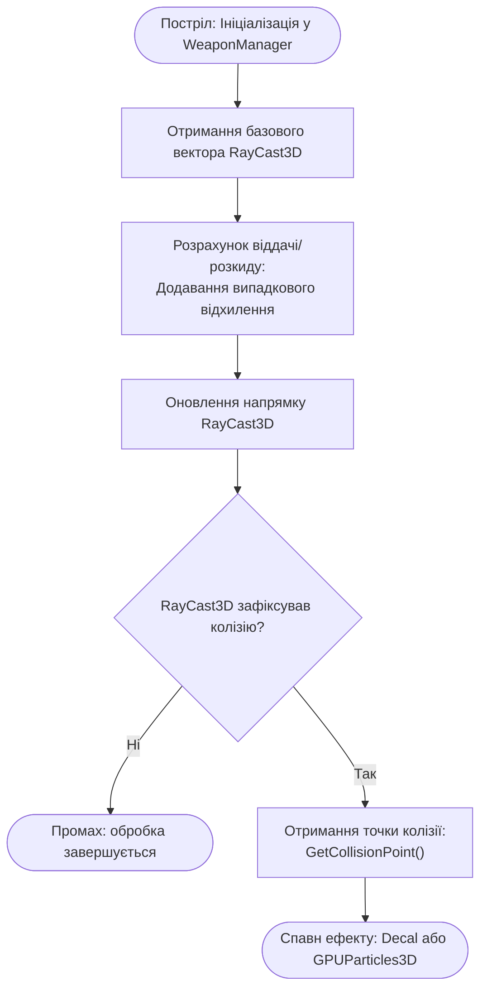

```mermaid
flowchart TD
    A(["Постріл: Ініціалізація у WeaponManager"]) --> B["Отримання базового вектора RayCast3D"]
    B --> C["Розрахунок віддачі/розкиду:<br>Додавання випадкового відхилення"]
    C --> D["Оновлення напрямку RayCast3D"]
    D --> E{"RayCast3D зафіксував колізію?"}
    E -- Ні --> F(["Промах: обробка завершується"])
    E -- Так --> G["Отримання точки колізії:<br>GetCollisionPoint()"]
    G --> H(["Спавн ефекту: Decal або GPUParticles3D"])
```