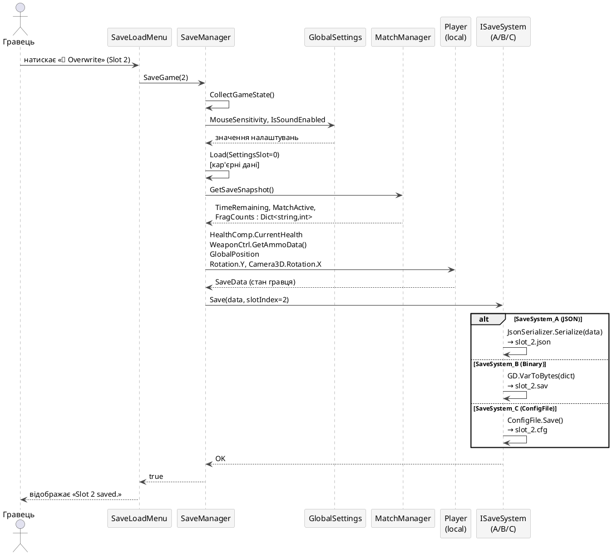
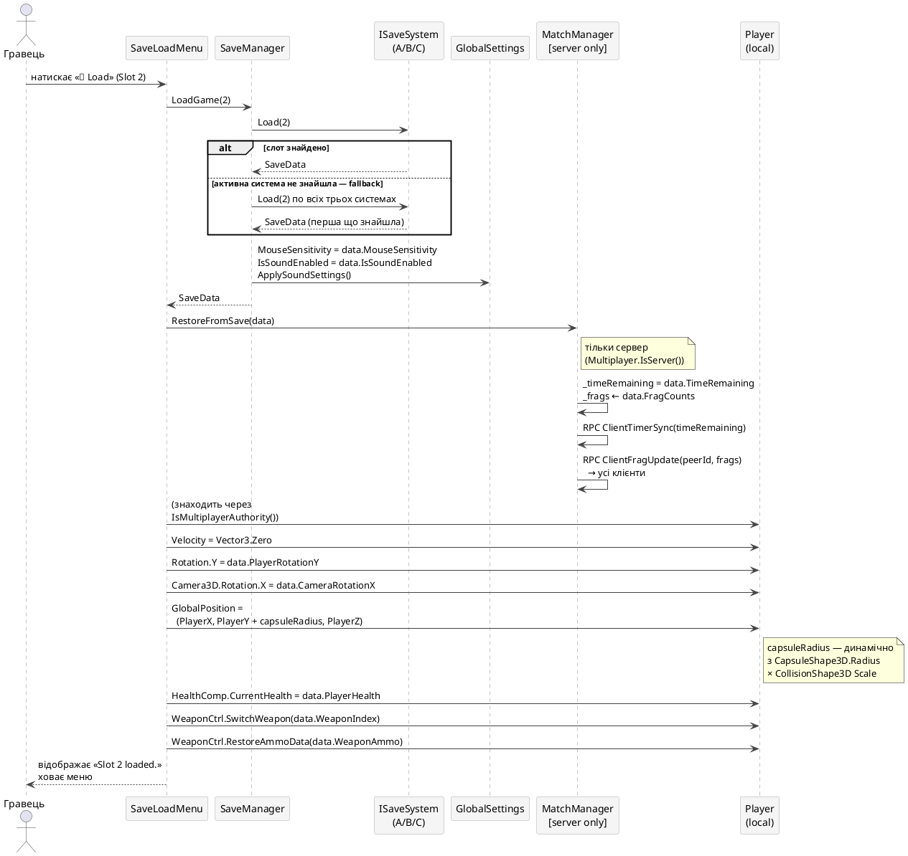

# КИЇВСЬКИЙ НАЦІОНАЛЬНИЙ УНІВЕРСИТЕТ
# ІМЕНІ ТАРАСА ШЕВЧЕНКА
## ФАКУЛЬТЕТ ІНФОРМАЦІЙНИХ ТЕХНОЛОГІЙ
### Кафедра інтелектуальних технологій

---

**Лабораторна робота №5**  
З дисципліни «Розробка ігрових додатків»

**Тема роботи:** «Реалізація збереження та відновлення стану гри»

**Варіант №24**

Виконали студенти  
групи КН-41:  
Тарасюк Назарій  
Домбровський Артур  
Русанов Даніїл  

Перевірила:  
Золотухіна Оксана Анатоліївна  

**Київ – 2026**

---

**Тема:** Реалізація збереження та відновлення стану гри

**Гра:** Shooter — мережевий дезматч від першої особи  
**Рушій:** Godot 4 (C#)

**Обґрунтування:**

Обрано архітектуру єдиного інтерфейсу `ISaveSystem` з трьома незалежними реалізаціями, де кожен учасник команди реалізує власний варіант серіалізації. Такий підхід забезпечує поліморфну взаємозамінність форматів: гравець перемикає підсистему в налаштуваннях, а решта коду залишається незмінною. Godot 4 + C# дозволяє використовувати як нативні API (`ConfigFile`, `GD.VarToBytes`) так і стандартні бібліотеки .NET (`System.Text.Json`), що дає змогу порівняти різні підходи в рамках одного проєкту.

---

## 2. Структура проєкту та розподіл ролей

Вся команда інтегрувала систему збереження в спільну кодову базу гри. Розподіл обов'язків відбувався за варіантами реалізації серіалізації:

**Тарасюк (SaveSystem_A — JSON):** Реалізація збереження та відновлення у форматі JSON через `System.Text.Json`. Інтеграція в бойову систему: збереження стану зброї (`WeaponIndex`, `WeaponAmmo`), розширення `WeaponBase.SetAmmo()` та `WeaponController.GetAmmoData()`.

**Русанов (SaveSystem_B — Binary):** Реалізація компактного двійкового формату через `GD.VarToBytes` / `GD.BytesToVar`. Інтеграція зі стороною фізики: збереження та відновлення позиції (`PlayerX/Y/Z`), кута повороту гравця та камери, коректний зсув по колайдеру при телепортації.

**Домбровський (SaveSystem_C — ConfigFile):** Реалізація INI-подібного формату через вбудований Godot `ConfigFile`. Розробка інтерфейсу системи слотів (`SaveLoadMenu`): перегляд слотів, збереження, завантаження, видалення. Додавання OptionButton вибору підсистеми в `SettingsMenu`.

---

## 3. Опис даних, що зберігаються

Гра є мережевим 3D-шутером у режимі «Дезматч» (15-хвилинний матч, рахунок фрагів). Збереження поділяється на п'ять категорій:

| Категорія | Дані | Обґрунтування |
|---|---|---|
| **Метадані слоту** | Назва, дата/час збереження, тривалість сесії, тип підсистеми | Відображаються у списку слотів |
| **Налаштування** | Чутливість миші, увімкнення звуку, обраний тип підсистеми збереження | Зберігаються між сесіями |
| **Стан матчу** | Час, що залишився; активний матч; кількість фрагів кожного гравця (ключ = peer ID) | Дозволяє відновити перебіг матчу |
| **Стан гравця** | Здоров'я, індекс активної зброї, патрони у кожній зброї, позиція (X/Y/Z), кути повороту тіла та камери | Відновлює конкретний стан персонажа |
| **Кар'єра / рекорди** | Найкращий результат фрагів, загальна кількість вбивств, смертей, зіграних матчів | Накопичується між матчами |

**Що свідомо не зберігається:** точна позиція мережевих пірів (відновлюється через RPC-синхронізацію), фізичний стан куль у польоті, стан ящиків та зон пошкодження.

**Клас `SaveData`** — єдина серіалізована модель для всіх трьох реалізацій:

```
SaveData
├── [Метадані]      SlotIndex, SaveName, SaveDate, PlayTimeSeconds, SaveSystemType
├── [Налаштування]  MouseSensitivity, IsSoundEnabled
├── [Матч]          TimeRemaining, MatchActive, FragCounts : Dict<string,int>
├── [Гравець]       PlayerHealth, WeaponIndex, WeaponAmmo : int[],
│                   PlayerX/Y/Z, PlayerRotationY, CameraRotationX
└── [Кар'єра]       BestFrags, TotalKills, TotalDeaths, TotalGames
```

**Схема слотів:**

```
user://saves/
├── slot_0.{json|sav|cfg}   ← авто-збереження: налаштування + кар'єра
├── slot_1.{json|sav|cfg}   ← ручний слот 1
├── slot_2.{json|sav|cfg}   ← ручний слот 2
├── slot_3.{json|sav|cfg}   ← ручний слот 3
└── slot_4.{json|sav|cfg}   ← ручний слот 4
```

Розширення файлу залежить від активної реалізації: `A` → `.json`, `B` → `.sav`, `C` → `.cfg`. При завантаженні `SaveManager` перебирає всі три системи, тому зміна реалізації не руйнує старі збереження.

---

## 4. Алгоритм збереження та відновлення

**Алгоритм збереження (`SaveManager.SaveGame`):**

```
1. Перевірити допустимість номера слоту (1–4).
2. Зібрати поточний стан гри (CollectGameState):
   a. Налаштування з GlobalSettings.Instance.
   b. Кар'єрні дані зі слоту 0 (щоб не перезаписати).
   c. Стан матчу з MatchManager.GetSaveSnapshot()
      → TimeRemaining, MatchActive, FragCounts.
   d. Стан гравця: HealthComponent.CurrentHealth,
      WeaponController.GetAmmoData(), GlobalPosition,
      Rotation.Y (yaw тіла), Camera3D.Rotation.X (pitch камери).
3. Встановити метадані: SlotIndex, SaveName, SaveDate (DateTime.Now),
   PlayTimeSeconds, SaveSystemType.
4. Викликати ISaveSystem.Save(data, slotIndex).
```

**Алгоритм відновлення (`SaveLoadMenu.OnLoadPressed`):**

```
1. SaveManager.LoadGame(slotIndex):
   a. ISaveSystem.Load(slotIndex) → SaveData.
      Якщо null — перебрати всі три системи (fallback).
   b. Одразу відновити GlobalSettings: MouseSensitivity, IsSoundEnabled.
2. MatchManager.RestoreFromSave(data) [тільки сервер]:
   a. _timeRemaining = data.TimeRemaining.
   b. _frags ← data.FragCounts.
   c. RPC ClientTimerSync + ClientFragUpdate до всіх клієнтів.
3. Знайти локального гравця (IsMultiplayerAuthority()):
   a. HealthComp.CurrentHealth = data.PlayerHealth.
   b. Velocity = Vector3.Zero (скинути інерцію).
   c. Rotation.Y = data.PlayerRotationY (поворот тіла).
   d. Camera3D.Rotation.X = data.CameraRotationX (нахил камери).
   e. GlobalPosition = (PlayerX, PlayerY + capsuleRadius, PlayerZ).
      Зсув Y = масштабований радіус капсули CollisionShape3D.
   f. WeaponCtrl.SwitchWeapon(data.WeaponIndex).
   g. WeaponCtrl.RestoreAmmoData(data.WeaponAmmo).
```

**Авто-збереження:**

| Тригер | Що зберігається | Де викликається |
|---|---|---|
| Зміна налаштувань | Налаштування → слот 0 | `SettingsMenu`: `OnSensChanged`, `OnSoundToggled`, `OnSaveSystemSelected` |
| Кінець матчу | Кар'єрні дані → слот 0 | `MatchManager._Process`, коли `_timeRemaining ≤ 0` |

---

## 5. Реалізовані варіанти серіалізації

Кожен учасник реалізував власний варіант підсистеми збереження, що реалізує інтерфейс `ISaveSystem`:

| Учасник | Варіант | Формат / Розширення | Реалізація та особливості |
|---|---|---|---|
| Тарасюк | **A — JSON** | Текст `.json` | `System.Text.Json.JsonSerializer`. Людиночитабельний, відступи, `PropertyNameCaseInsensitive`. Зручний для відлагодження та ручного редагування. |
| Русанов | **B — Binary** | Двійковий `.sav` | Пакує `SaveData` у `Godot.Collections.Dictionary`, серіалізує через `GD.VarToBytes`. Зберігає: `uint32` довжина + байти. Компактний, не читається без інструментів. |
| Домбровський | **C — ConfigFile** | INI-подібний `.cfg` | Вбудований Godot `ConfigFile`. Секції: `[meta]`, `[settings]`, `[match]`, `[player]`, `[stats]`. Нативний для Godot, зручний для ітеративного налаштування. |

**Ідентифікація реалізації:** поле `SaveSystemType` у `SaveData` зберігає тег `"A"`, `"B"` або `"C"`. При завантаженні `LoadSettings()` читає тег і автоматично відновлює обрану підсистему.

**Приклад файлу SaveSystem_A (JSON, `slot_1.json`):**

```json
{
  "SlotIndex": 1,
  "SaveName": "Slot 1",
  "SaveDate": "2026-05-20 14:32:07",
  "PlayTimeSeconds": 743,
  "SaveSystemType": "A",
  "MouseSensitivity": 0.0025,
  "IsSoundEnabled": true,
  "TimeRemaining": 412.5,
  "MatchActive": true,
  "FragCounts": { "1": 7, "2354891023": 4 },
  "PlayerHealth": 65,
  "WeaponIndex": 1,
  "WeaponAmmo": [12, 28, 5],
  "PlayerX": 3.14,
  "PlayerY": -0.2,
  "PlayerZ": -8.72,
  "PlayerRotationY": 1.047,
  "CameraRotationX": -0.314,
  "BestFrags": 11,
  "TotalKills": 47,
  "TotalDeaths": 30,
  "TotalGames": 6
}
```

**Приклад файлу SaveSystem_C (ConfigFile, `slot_1.cfg`):**

```ini
[meta]
slot_index=1
save_name="Slot 1"
save_date="2026-05-20 14:32:07"
play_time_seconds=743
save_system_type="C"

[settings]
mouse_sensitivity=0.0025
is_sound_enabled=true

[match]
time_remaining=412.5
match_active=true
frag_counts=["1:7", "2354891023:4"]

[player]
health=65
weapon_index=1
weapon_ammo=[12, 28, 5]
pos_x=3.14
pos_y=-0.2
pos_z=-8.72
rotation_y=1.047
camera_x=-0.314

[stats]
best_frags=11
total_kills=47
total_deaths=30
total_games=6
```

---

## 6. Базова логіка системи збереження

**Ініціалізація:** `SaveManager` реєструється як Godot autoload у `project.godot`. У `_Ready()` автоматично викликає `LoadSettings()` — читає слот 0 та відновлює налаштування та обрану підсистему.

**Перемикання реалізації:** Гравець обирає підсистему (A / B / C) через `OptionButton` у `SettingsMenu`. `SaveManager.SetSaveSystem(index)` миттєво змінює активну реалізацію та зберігає вибір у слоті 0. Зміна не руйнує існуючі файли інших форматів.

**Система слотів:** 5 слотів (0–4). Слот 0 — виключно для авто-збереження (налаштування + кар'єра). Слоти 1–4 — ручні збереження матчу. `GetAllSlotsMeta()` повертає метадані всіх слотів для відображення в UI. `DeleteSlot()` видаляє файл у **всіх трьох форматах** одночасно, щоб запобігти застарілим файлам.

**Захист від провалювання крізь підлогу при відновленні:** при виклику `RestoreLocalPlayer()` скидається `Velocity = Vector3.Zero` (усуває залишкову гравітацію попереднього кадру), потім обчислюється зсув по Y з реального `CapsuleShape3D`:

```
yOffset = capsule.Radius × CollisionShape3D.Transform.Basis.Scale.X
```

Для стандартних параметрів Player.tscn: `yOffset = 0.5 × 0.8 = 0.4`. Це забезпечує достатній відступ до того, як на першому тіку `MovementComponent.AirMove()` застосує гравітацію.

**Компонентна інтеграція:**

| Компонент | Зміна | Призначення |
|---|---|---|
| `GlobalSettings` | + `SaveSystemIndex` | Зберігає обраний варіант підсистеми |
| `MatchManager` | + `GetSaveSnapshot()`, `RestoreFromSave()` | Знімок / відновлення стану матчу |
| `WeaponBase` | + `SetAmmo(int)` | Відновлення патронів зі збереження |
| `WeaponController` | + `GetAmmoData()`, `RestoreAmmoData()` | Серіалізація / десеріалізація амуніції |
| `HUD` | + кнопка «💾 Save / Load» в Escape-панелі | UI-доступ до системи збереження |
| `SettingsMenu` | + `OptionButton` вибору A/B/C | Перемикач реалізацій |
| `project.godot` | + `SaveManager` в `[autoload]` | Глобальна доступність синглтону |

---

## 7. Схема збереження та відновлення

Рисунок 1 – Потік даних при збереженні



Рисунок 2 – Потік даних при завантаженні



---

## 8. Технічні висновки

У проєкті реалізовано повноцінну систему збереження та відновлення стану для мережевого 3D-шутера на Godot 4 (C#). Архітектурним ядром є єдиний інтерфейс `ISaveSystem`, що дозволяє прозоро перемикати формат файлу між трьома реалізаціями без зміни решти коду гри.

Кожна реалізація має чітко виражені переваги: **JSON (A)** є людиночитабельним і зручним для відлагодження, **Binary (B)** забезпечує компактність і непрямий захист від ручного редагування, **ConfigFile (C)** є нативним для Godot та природно відображає структуровані дані в секціях. Порівняння трьох підходів у рамках одного проєкту дало змогу практично оцінити компроміси між читабельністю, обсягом файлу та складністю реалізації.

Під час розробки виявлено та вирішено специфічну проблему Godot 4 — провалювання `CharacterBody3D` крізь підлогу при телепортації. Причиною є однофреймова затримка: `IsOnFloor()` повертає `false` одразу після зміни `GlobalPosition`, тому `MovementComponent.AirMove()` застосовує гравітацію до того, як рушій перераховує зіткнення. Розв'язок: скидати `Velocity = Vector3.Zero` та додавати зсув по Y, рівний масштабованому радіусу капсули колайдера — значення читається динамічно з `CapsuleShape3D` і не залежить від хардкоднутих констант.

Клієнт-серверна модель потребувала розмежування відповідальності при відновленні: стан матчу (таймер, фраги) відновлює виключно сервер через авторитетні RPC-методи `ClientTimerSync` та `ClientFragUpdate`. Налаштування відновлюються локально на кожному клієнті без мережевої взаємодії. Збереження кутів повороту гравця (`Rotation.Y`) та камери (`Camera3D.Rotation.X`) вирішило проблему «збився приціл» після завантаження збереження.

Розробка підтвердила, що для ігрових проєктів ефективнішою є стратегія збереження **параметрів прогресу**, а не повного фізичного стану сцени — це суттєво спрощує реалізацію та забезпечує надійне відновлення навіть у мережевому режимі.
